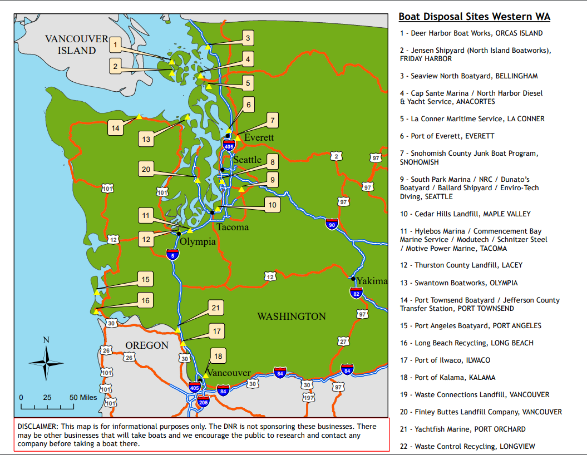

During the summer of 2018, I worked as a GIS Intern in the Center for Conservation Innovation
at the Defenders of Wildlife headquarters in Washington, D.C.
My supervisor was [Matthew Moskwik, PhD](https://defenders.org/staff/matthew-moskwik) - Conservation GIS Scientist.

#### Washington Boat Disposal Sites map
One of my projects involved working on derelict vessel issues in Washington State.
I corresponded with Tammy Robbins, the Natural Resource Specialist of the Aquatic Resources Division
at the Washington State Department of Natural Resources.
I helped identify and map boat disposal locations throughout Washington state.

#### Alaska Oil Spill Report flyers
I took on a project that was handed to my supervisor by Karla M. Dutton, the Alaska Program Director for Defenders of Wildlife.
I updated oil spill report flyers to display Cook Inlet and the Kodiak Region. Maureen Gregory of the graphic design team at Defenders of
Wildlife HQ added the endangered species and National Response Center hotline information around the maps I created.
These flyers would later be distributed to schools, washaterias, and other public facilities in the Alaskan community.

In order to create these maps, I used ArcMap for the basemap, added Coast Guard boundaries, and created point shapefiles of major towns
and villages.

