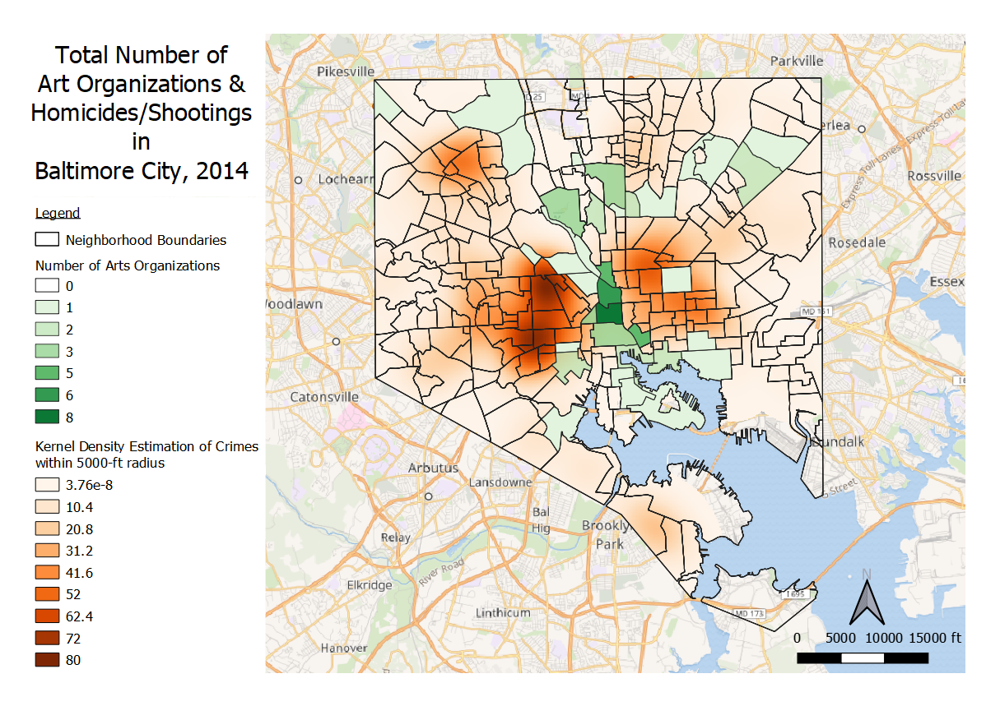
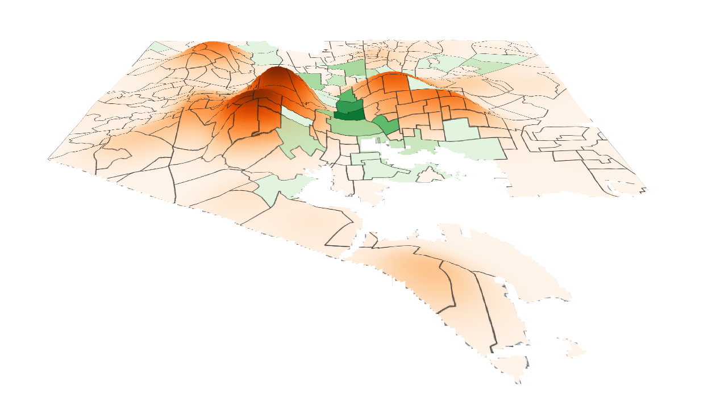

This project aims to shed light on how creative placemaking can impact public safety outcomes in Baltimore City.

Public safety refers to the welfare and protection of the general public, and strives
towards a vibrant community where “people feel free of threats to their persons and
property.”

Creative placemaking is an emerging form of participatory art-making, given increasing attention by
scholars, practitioners, policymakers, and funders over the past decade. Creative placemaking adds
dimensions of art and creative practice to the placemaking field, promoting the belief that
community development should be holistic and human-centered (Bennett 2014).

In practice, creative placemaking combines the field of planning with community relationship-building;
it places a high value on streetscapes and is designed to improve economic outcomes by utilizing
undervalued resources and developing strong social networks through artistic practice (Stern 2014).

Projects at the intersection of creative placemaking and public safety fall into five primary
types of activities: projects that promote empathy and understanding, projects that influence
law and policy, projects that provide career opportunities, projects that support well-being, and
projects that advance quality of place.

My final project for GES 486 was inspired by a 2017 report by the Social Impact of the Arts Project (SIAP) at the University of
Pennsylvania. The results of the three-year study showed how cultural resources are significantly linked to better health, schooling,
and security in New York City's lower-income neighborhoods. I performed a similar preliminary analysis on Baltimore City's
neighborhoods, arts organizations, and violent crimes (specifically homicides and shootings).

#### Process

Question: Does the presence of art organizations affect crime rates in Baltimore City?

The first thing I had to do was gather [crime data](https://data.baltimorecity.gov/Public-Safety/BPD-Part-1-Victim-Based-Crime-Data/wsfq-mvij/data) for Baltimore City. I downloaded the csv file and used SQL to extract all crimes for 2014 only, then created a new
shapefile for 2014 crimes.

Once I had all homicides and shootings that occurred in Baltimore City in 2014, I used Python to select and count these specific crimes
by neighborhood. I also used [neighborhood census data](https://data.baltimorecity.gov/Neighborhoods/2010-Census-Neighborhoods/r3qj-2ifh) to take into account the population of each neighborhood.

```python
lyrPts = iface.addVectorLayer("Z:/ges486/final_proj/all2014homi_shoot.shp", "Crimes", "ogr")
selection = lyrPts.getFeatures(QgsFeatureRequest(). setFilterExpression(u'"Neighborho" = \'Brooklyn\''))
lyrPts.selectByIds([s.id() for s in selection])
```


* Added delimited text layer
* Used Wikimedia Map for basemap
* Edited the [original 2014 Crimes .csv file](https://data.baltimorecity.gov/Public-Safety/BPD-Part-1-Victim-Based-Crime-Data/wsfq-mvij/data) to separate from addresses and coordinates (https://trumpexcel.com/split-multiple-lines/).
* Edited the [original Art Organizations file]() to get [coordinates](http://www.gpsvisualizer.com/geocoder/).
* Added empty column before “Crime Date” → =TEXT(B1,"yyyymmdd") to later select only 2014 crimes using SQL.
* Made 2 new columns in the Neighborhoods 2010 shapefile: counted crimes, counted art. in order to perform Moran's I analysis later.

* Projected layers to EPSG:2248 - NAD83/Maryland(ftUS)



* Radius of 5000 feet (and decreased number of rows to 500).
* Clip raster by mask layer (input layer: heatmap, mask layer: neighborhoods)



* Using a vertical scale of 60 and Tile resolution of 200.

#### Findings

Bivariate Local Moran's I:


Cluster Map:


Moran's Scatter Plot:


Regression Report:


with count_crimes as dependent variable and count_artorgs as covariate.

#### Future Research

__Author:__ Christine Chang

__Languages:__ HTML, Markdown, Python, SQL

__Applications:__ QGIS, GeoDa

__Data Sources:__ All data is from [Open Baltimore](https://data.baltimorecity.gov/).

[Arts Organizations](https://data.baltimorecity.gov/Culture-Arts/Baltimore-Arts-Organizations/r4ur-u5nm), [All Crimes 2012-2018](https://data.baltimorecity.gov/Public-Safety/BPD-Part-1-Victim-Based-Crime-Data/wsfq-mvij/data), [Neighborhood Boundaries 2010](https://data.baltimorecity.gov/Neighborhoods/Neighborhoods-Shape/ysi8-7icr).
