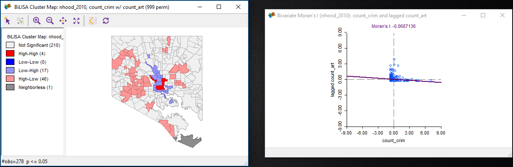

#### Process
Question: Does the presence of art organizations affect crime rates in Baltimore City?

```python
lyrPts = iface.addVectorLayer("Z:/ges486/final_proj/all2014homi_shoot.shp", "Crimes", "ogr")
selection = lyrPts.getFeatures(QgsFeatureRequest(). setFilterExpression(u'"Neighborho" = \'Beechfield\''))
lyrPts.selectByIds([s.id() for s in selection])
iface.mapCanvas().zoomToSelected()
```


* Added delimted text layer
* Used Wikimedia Map for basemap


#### Data

#### Tools Used

#### Findings




#### Future Research

