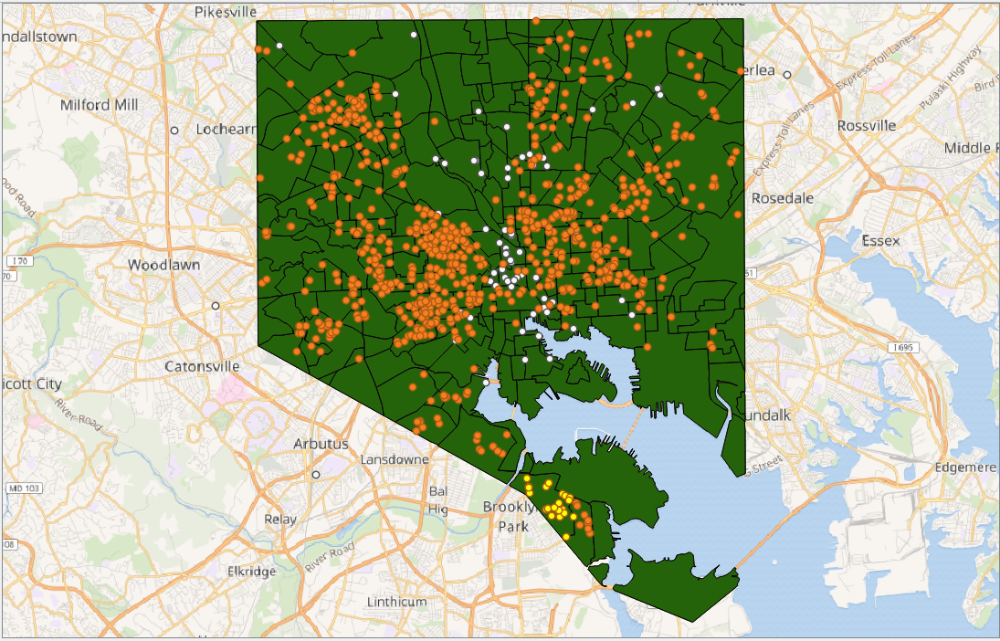
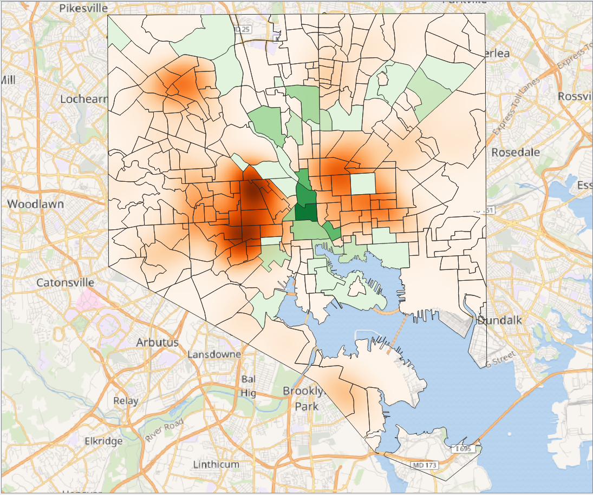
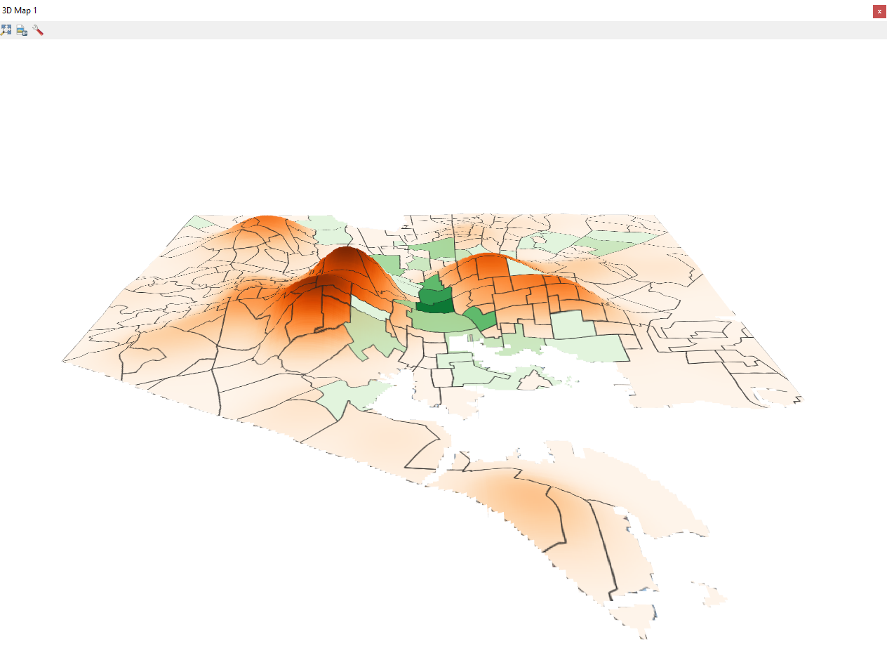
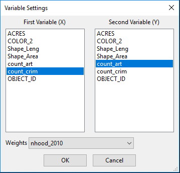
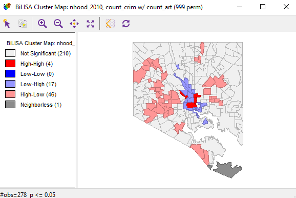
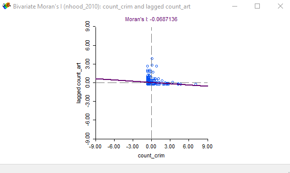
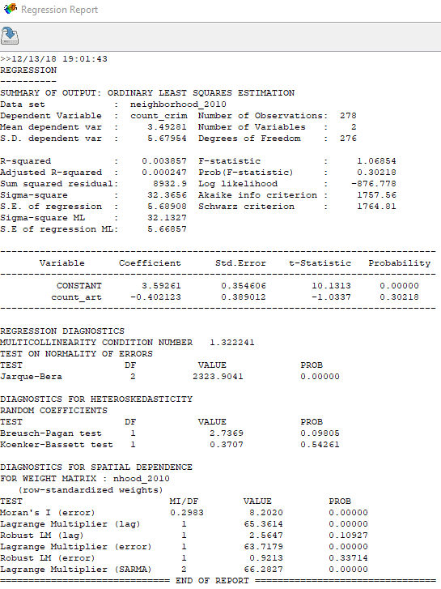

#### Process

Question: Does the presence of art organizations affect crime rates in Baltimore City?

```python
lyrPts = iface.addVectorLayer("Z:/ges486/final_proj/all2014homi_shoot.shp", "Crimes", "ogr")
selection = lyrPts.getFeatures(QgsFeatureRequest(). setFilterExpression(u'"Neighborho" = \'Brooklyn\''))
lyrPts.selectByIds([s.id() for s in selection])
```


* Added delimited text layer
* Used Wikimedia Map for basemap
* Edited the [original 2014 Crimes .csv file](https://data.baltimorecity.gov/Public-Safety/BPD-Part-1-Victim-Based-Crime-Data/wsfq-mvij/data) to separate from addresses and coordinates (https://trumpexcel.com/split-multiple-lines/).
* Edited the [original Art Organizations file]() to get [coordinates](http://www.gpsvisualizer.com/geocoder/).
* Added empty column before “Crime Date” → =TEXT(B1,"yyyymmdd") to later select only 2014 crimes using SQL.
* Made 2 new columns in the Neighborhoods 2010 shapefile: counted crimes, counted art. in order to perform Moran's I analysis later.

* Projected layers to EPSG:2248 - NAD83/Maryland(ftUS)



* Increased radius to 5000 and decreased number of rows to 50.



* Using a vertical scale of 60 and Tile resolution of 200.

#### Findings



Bivariate Local Moran's I




Cluster Map & Moran's Scatter Plot



with crimes_count as dependent variable and artorgs_count as covariate.

#### Future Research

__Author:__ Christine Chang

__Languages:__ HTML, Markdown, Python, SQL

__Applications:__ QGIS, GeoDa

__Data Sources:__ All data is from [Open Baltimore](https://data.baltimorecity.gov/).

[Arts Organizations](https://data.baltimorecity.gov/Culture-Arts/Baltimore-Arts-Organizations/r4ur-u5nm), [All Crimes 2012-2018](https://data.baltimorecity.gov/Public-Safety/BPD-Part-1-Victim-Based-Crime-Data/wsfq-mvij/data), [Neighborhood Boundaries 2010](https://data.baltimorecity.gov/Neighborhoods/Neighborhoods-Shape/ysi8-7icr).
