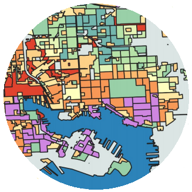
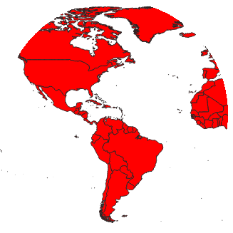

<!--This is the first row of projects -->

###### Lab 1

[See more details here.](https://chricha1.github.io/lab1/lab1.html)

###### Lab 4

[See more details here.](https://chricha1.github.io/lab4/lab4.html)

<!--This is the second row of projects -->

  
###### Lab 5

[See more details here.](https://chricha1.github.io/lab5/lab5.html)

###### Lab 6

[See more details here.](https://chricha1.github.io/lab6/lab6.html)

###### Final Project

[See more details here.](https://chricha1.github.io/finalproject/finalproject.html)

###### Defenders of Wildlife Internship

[See more details here.](https://chricha1.github.io/Internship1/intern1.html)
