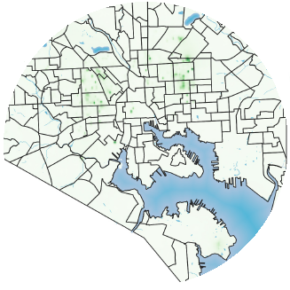

<!--This is the first row of projects -->

### Lab 1

[See more details here.](https://chricha1.github.io/lab1/lab1.html)

<small>__Tools__: QGIS, YouTube
  
<small>__Data__: 
[City of Baltimore Open GIS Data Site](http://gis-baltimore.opendata.arcgis.com/)

### Lab 6

[See more details here.](https://chricha1.github.io/lab6/lab6.html)

<small>__Tools__: GeoDa

<small>__Data__: 
[Baltimore Neighborhood Indicators Alliance](https://bniajfi.org/vital_signs/)

<!--This is the second row of projects -->

### Project 1

[See more details here.](https://chricha1.github.io/Project1/Project1.html)

<small>__Tools__: 

<small>__Data__: 
[Baltimore City Open GIS Data](http://gis-baltimore.opendata.arcgis.com/)

### Final Project

[See more details here.](https://chricha1.github.io/finalproject/finalproject.html)

<small>__Tools__: QGIS, Python, GeoDa, Excel

<small>__Data__: [City of Baltimore](https://data.baltimorecity.gov/Neighborhoods/2010-Census-Neighborhoods/r3qj-2ifh)

<!--This is the third row of projects -->

### Defenders of Wildlife Internship

[See more details here.](https://chricha1.github.io/Internship1/intern1.html)

<small>__Tools__: ArcMap, R, Excel

<small>__Data__:
[Washington State Department of Natural Resources](https://www.dnr.wa.gov/programs-and-services/aquatics/derelict-vessels/vessel-turn-program)
