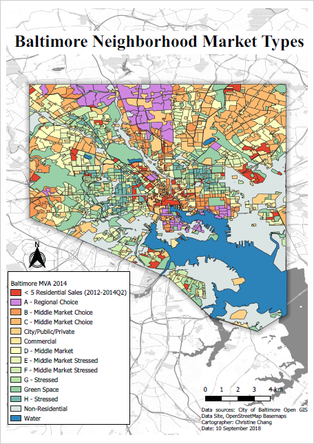

#### Process of Creating the Map
For guidelines on how to add visual details to the map, I did a Google search of "Baltimore MVA"
to see what types of colors others have used to make a map like this. I also watched two map production videos on YouTube,
[Cartography with QGIS Task 1](https://www.youtube.com/watch?v=pb8EJFV4SLs) and [Cartography with QGIS Task 2](https://www.youtube.com/watch?v=5TpCuwGeDZc).
From the Task 1 video, I learned layer styling techniques such as inverted polygon shapeburst fill, 

I used the given shapefile called "baltimore_mva_2014" shapefile, which contained the market types in the column hmt.

For the basemap, I used [Stamen Toner](https://www.xyht.com/spatial-itgis/using-openstreetmap-basemaps-qgis-3-0/).

#### Tools Used
I used Open Street Map for the basemap, and a Baltimore City boundary from the City of Baltimore Open GIS Data Site for the drop shadow.
I used QGIS Print Layout to compose the map. 

#### Findings
I found that for the Baltimore Housing Typology, the ideal market was towards the center of downtown and the north.
Surrounding those areas were mostly stressed, and there were some middle market choices on the outskirts.

#### Future Alterations
After some reflection, I realized using different colors for types F, G, and H would represent them better because their colors were too
similar to the color I used to represent green space.

